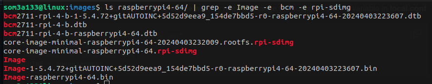

# 1. Setting up Enviornment

1. 50 Gb of free disk
2. Need to download the following essential tool to build yocto project

```shell
sudo apt-get install gawk wget git-core diffstat unzip texinfo gcc-multilib \
build-essential chrpath socat cpio python python3 python3-pip python3-pexpect \
xz-utils debianutils iputils-ping python3-git python3-jinja2 libegl1-mesa libsdl1.2-dev \
pylint3 xterm
```

# 2. Download Yocto

### What is Poky?

Poky is a *reference distribution of the Yocto Project®. It contains the OpenEmbedded Build System (BitBake and OpenEmbedded Core) as well as a set of metadata to get you started building your own distro.*

```
git clone -b kirkstone git://git.yoctoproject.org/poky.git --depth=1
cd poky/
```

# 3. Configuration for Poky !

Run oe-init-build-env to set the environment for poky it will make [build/] directory where conf , downloads ,tmp ..etc will be found there

```
source oe-init-build-env
```


## for Qemu

```
cd conf/
```


```
vim local.conf
```

Check for variable called MACHINE  it 's our machine name

```
#Default Machine is qemux86-64
 MACHINE ??= "qemux86-64"
```

You can change download / sstate /tmp directories by editing there variables

```
#SSTATE_DIR ?= "{TOPDIR}/sstate-cache"
#DL_DIR ?= "#DL_DIR ?= "{TOPDIR}/downloads"
#TMPDIR = "${TOPDIR}/tmp"
```

Adding package : add this variable

```
IMAGE_INSTALL_append = "ANY CHOSEN PACK" 
```

## for Raspberry pi 4 - 64

```
cd conf/
vim local.conf
```

Check for variable called MACHINE  it 's our machine name [ Check for machines configs in meta-raspberrypi to check for all supported machine of pi]

```
#Change Machine ?? to raspi4-64
 MACHINE ??= "raspberrypi4-64"
```

You can change download / sstate /tmp directories by editing there variables

```
#SSTATE_DIR ?= "{TOPDIR}/sstate-cache"
#DL_DIR ?= "#DL_DIR ?= "{TOPDIR}/downloads"
#TMPDIR = "${TOPDIR}/tmp"
```

**Adding package** : add this variable `IMAGE_INSTALL_append`  to add a pck

lets try to add dropbear for ssh connection:

```
IMAGE_INSTALL_append = "dropbear" 
```

**Build an sd.img for SD Card** : add varibale IMAGE_FSTYPES

```
IMAGE_FSTYPES = "tar.xz ext3 rpi-sdimg"
#IMAGE_FSTYPES +="rpi-sdimg"
```

**Add meta-layer for raspberrypi to our bblayers**

**downlaod meta layer for rpi :**

```
#Go back to the main poky folder
cd poky/
git clone  -b kirkstone https://github.com/agherzan/meta-raspberrypi.git --depth=1
```

```
cd build/conf
vim bblayers.conf
```


# 4. Build Yocto image

This command will bitbake the recipe defined by default in build/ directory .

```
bitbake core-image-minimal -k 
```

[-k] option for skipping errors and continue build and will show them at end.

# 5. Errors ! No problem

```
bitbake -c clean <PACK NAME>
```

Example:

```
ERROR: Task (/home/som3a133/Desktop/EmbeddedLinux/yocto/poky/meta/recipes-devtools/binutils/binutils_2.34.bb:do_compile) failed with exit code '1'
```

```
bitbake -c clean binutils
```

## Build again :)

```
bitbake core-image-minimal -k 
```

# 6. Results

**Default output path : build/tmp/deploy/images**


**for Qemux86-6 run qemu image : [if runqemu not found just use source oe-init-build-env] as variables are gone when you terminate your working terminal**

```
runqemu qemux86-64
```


### **For RaspberryPi 4-64**



**Flash using dd command :**

```
sudo dd if=<image-name.rpi-sdimg> of=/dev/sda
```


