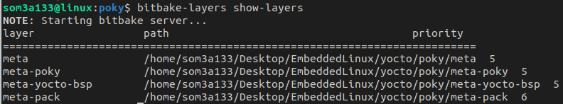
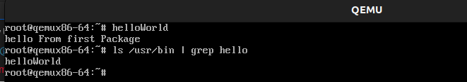

# 1. Creating a layer

The easiest and the most recommended method to create a new layer is using the `bitbake-layers` script. This script is already available for you once you have sourced the `oe-build-init-env` script inside `poky/`.

This command will automaticaly crate a layer with layer.conf & an example recipe

```
 bitbake-layers create-layer ./meta-pack
```

```
├── conf
│   └── layer.conf
├── recipes-example
│   └── example
│       └── example_0.1.bb
```

To check bitbake-layers command what can it do as add / remove / create / show

```
bitbake-layers --help
```

now add your meta-pack layer to build configuration

```
bitbake-layers add-layer ./meta-pack
```

```
bitbake-layers show-layers
```



**Build the recipe**

```
bitbake example
```

# 2. Creating Recipe

1. Under meta-pack  create a new folder name recipes-hwl   [hwl for hello world layer]
2. create directory called hello , create hello_0.1.bb under it
3. create files directory under hello
4. tree of that should be looks like that:

   ```
   .
   └── hello
       ├── files
       │   └── hello.c
       └── hello_0.1.bb
   ```

Using skeletal recipe as a base lets edit our hello_0.1.bb

```
DESCRIPTION = "This is a simple Hello World recipe - uses a local source file"
HOMEPAGE = "https://kickstartembedded.com"
LICENSE = "MIT"
LIC_FILES_CHKSUM = "file://${COMMON_LICENSE_DIR}/MIT;md5=0835ade698e0bcf8506ecda2f7b4f302"
SRC_URI = "file://hello.c"
S = "${WORKDIR}"
do_compile() {
	{CC} CC{LDFLAGS} hello.c -o helloWorld
}
do_install() {
	install -d {D}D{bindir}
	install -m 0755 helloWorld {D}D{bindir}
}
```

Our hello.c:

```
#include <stdio.h>

int main(void)
{
	printf("hello From first Package\n");
	return 0;
}

```

**Build the recipe hello :**

```
bitbake hello
```

# 3. Adding Pack from layers

```
cd poky/
source  oe-build-init-env
#Now we are in build directory
cd conf/
vim local.conf

```

Add IMAGE_INSTALL_append = " hello"

This will add `helloWorld binary` to our image in `/usr/bin `of our target rootfs

**Now Build our image**

```
bitbake core-image-minimal -k
```

# 4. Results on Qemux86-64

```
runqemu qemux86-64
```


