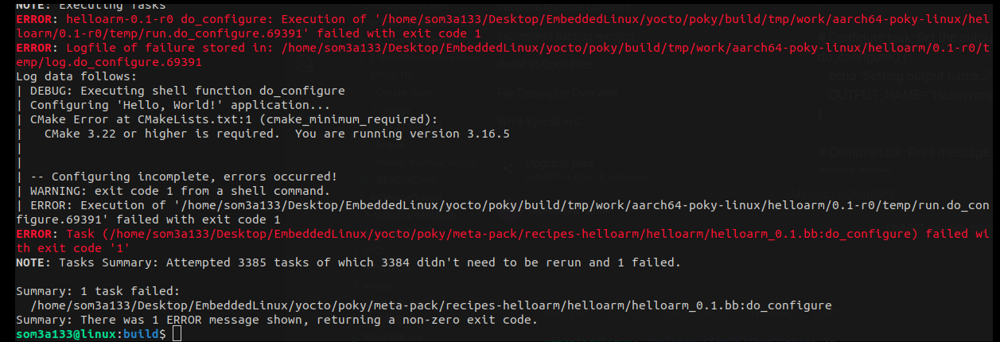
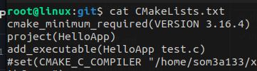
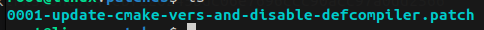
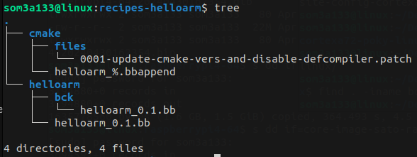
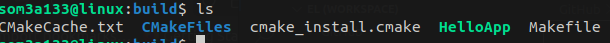

## Introduction to Patching in Yocto

Welcome to our project repository. In embedded systems development, ensuring software meets specific requirements often involves modifying the source code of open-source packages. In the Yocto Project, this is accomplished through the use of patches. Patches allow us to make necessary adjustments to the source code before it is compiled and included in our final embedded Linux image.

### What is a Patch?

A patch is a file that consists of a list of differences between the original source code and the modified code. It is applied to the source files using tools like `patch` or `git apply`. This process updates parts of the codebase without altering the original source files permanently, making it easier to manage changes and share improvements.

### Why We Use Patches

Patches are crucial for:

* **Fixing Bugs** : Quickly addressing issues in the upstream source that affect our project without waiting for official changes.
* **Adding Features** : Implementing new features specific to our needs that are not present in the standard version of the software.
* **Customizing Behavior** : Tweaking the behavior of existing software to better suit our specific hardware or use cases.
* **Maintaining Clarity** : Keeping our changes separate from the original source code helps maintain clarity and organization, making updates and maintenance easier.

# Example Yocto Recipe

**In the previous section we created a recipe that fetch source code from github repo and Built it using cmake.**

**Notes** : Yocto dunfell cmake version is 3.16.4 and CMakelists.txt of our fetched code required minimum version of 3.22 so it will Give us a beautiful error . Here we need to downgrade to 3.16.4 . To be able to build our recipe



## Step 1: Identify the Recipe to Extend/Modify

First, you need to decide which existing recipe you want to modify or enhance. This could be for adding patches, additional configuration, changing the source URI, or modifying build steps. in Our case recipe will be **helloarm**

Here wil will do some changes in our fetched CMakeLists.txt

```
cmake_minimum_required(VERSION 3.22)
project(HelloApp)
add_executable(HelloApp test.c)
set(CMAKE_C_COMPILER "/home/som3a133/x-tools/arm-cortexa9_neon-linux-musleabihf/bin/arm-cortexa9_neon-linux-musleabihf-gcc")
set(CMAKE_EXE_LINKER_FLAGS "-static")
```

Here we will change the version of this cmake to `3.16.4` & want to remove this  `set(CMAKE_C_COMPILER...)`

## Step 2: Create .patch File

```
bitbake -c devshell helloarm
```

It will open a new terminal in git folder which is in your tmp/work directoy

We will start by these steps:

* **git init**
* **git add** *
* **Edit** CMakeLists using vim or any editor
* **git status** (shows that the file is modified)
* **git add `<path>/CMakeLists.txt`**
* **git commit -m *"update cmake vers and disable-defcompiler"***

  
* **git log** (commit history)
* **git format-patch HEAD~1**  {Generates patch file for last commit}
* **ls** (checks if patch file is there)

  
* Copy the patch file into <**new/same-recipe-folder>/files** folder
* execute **exit** to exit devshell

## Step 3: Create the `.bbappend` File

Create a `.bbappend` file in your custom layer with the same name as the recipe you are appending. For example, if you want to append to `helloarm_0.1.bb`, you would create `helloarm_%.bbappend`

Place this file in a similar path structure as the original recipe within your custom layer, typically under `recipes-helloarm`, for example:



Creating a `.bbappend` file in the Yocto Project is a powerful way to modify or extend an existing recipe without changing the original `.bb` file. Here are the steps to create your first `.bbappend` file:

```
vim helloarm_%.bbappend

FILESEXTRAPATHS_prepend := "${THISDIR}/files:"

SRC_URI_append = " file://0001-update-cmake-vers-and-disable-defcompiler.patch"

S = "${WORKDIR}/git"

```

* **Description** : This appends a new source file, specifically a patch file, to the `SRC_URI` variable of the original recipe.
* **Purpose** : The patch named `0001-update-cmake-vers-and-disable-defcompiler.patch` is added to the list of sources that will be fetched and applied during the build process. This is used to modify the original source code to update the CMake version used .

## Step 4: Test Your Changes

```
bitbake -c clean helloarm
bitbake helloarm

```

**Debug** using  `bitbake -e <recipe-name> | less`

**Output of work dir : so build is done and our app is compiled**


