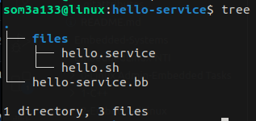

# Init Managers in the Yocto Project

In the Yocto Project, **init managers** control the boot process and manage system services. Two common init systems are **Systemd** and  **SysVinit** .

## SysVinit

**SysVinit** is a traditional, script-based init system used primarily in systems where simplicity and a smaller footprint are critical.

#### By default, the Yocto Project uses SystemV

#### Configuring SysVinit in local.conf

```
VIRTUAL-RUNTIME_init_manager = "sysvinit"
VIRTUAL-RUNTIME_initscripts = "initscripts"
```

To add an init script:

1. Create a script to handle start, stop, and restart commands.
2. Install it to `/etc/init.d/` in your recipe.

## Systemd

**Systemd** is a modern init system that uses unit files for service management. It provides fast boot times and powerful management capabilities.

#### Configuring Systemd

```
DISTRO_FEATURES:append = " systemd"
DISTRO_FEATURES_BACKFILL_CONSIDERED += "sysvinit"
VIRTUAL-RUNTIME_init_manager = "systemd"
VIRTUAL-RUNTIME_initscripts = "systemd-compat-units"
```


# Example SystemD service Recipe



### Step 1: Create your script/app 

```
#!/bin/bash
while true; do
    echo "Hello, world!"
    sleep 1
done

```

### Step 2 : Create service to run your .sh

```
[Unit]
Description=Continuous Hello World Service

[Service]
ExecStart=/usr/bin/hello.sh

[Install]
WantedBy=multi-user.target

```

### Step 3: Create .bb recipe file

```
SUMMARY = "A Example of a recipe that utilizes systemd"
DEESCRIPTION = "Runs hello.sh script using a systemd service"
LICENSE = "MIT"
LIC_FILES_CHKSUM = "file://${COREBASE}/meta/COPYING.MIT;md5=3da9cfbcb788c80a0384361b4de20420"

SRC_URI = "file://hello.sh \
           file://hello.service "

inherit systemd

S = "${WORKDIR}"

SYSTEMD_AUTO_ENABLE = "enable"
SYSTEMD_SERVICE:${PN} = "hello.service"

do_install() {
    install -d ${D}${bindir}
    install -m 0755 ${S}/hello.sh ${D}${bindir}
  
#    systemd_unitdir = /lib/systemd/
#    sysconfdir = /etc

    install -d ${D}/${sysconfdir}/systemd/system
    install -m 0644 ${S}/sysd.service ${D}/${sysconfdir}/systemd/system

#    install -d ${D}/${systemd_unitdir}/system
#    install -m 0644 ${S}/sysd.service ${D}/${systemd_unitdir}/system
}
```

**To Enable The service by default :**

```
SYSTEMD_AUTO_ENABLE = "enable"
SYSTEMD_SERVICE:${PN} = "hello.service
```

**To add this service** to your image just do `IMAGE_INSTALL +="`
