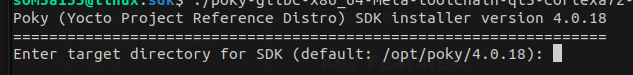
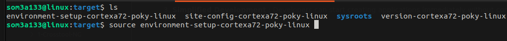

# Software Development Kit

The Yocto SDK (Software Development Kit) is a crucial tool provided by the Yocto Project to simplify the development of applications for custom Linux images built with Yocto. Essentially, the SDK provides a cross-compilation environment that includes all the necessary tools, libraries, and headers specific to the target hardware for which the Linux image is intended. Here’s a quick rundown of its key features and usage:

### Key Features:

1. **Cross-Compiler** : Tools that allow code to be compiled for a specific target device, not the machine where the code is written.
2. **Pre-configured** : Automatically set up with the correct libraries and headers matching those on the target device.
3. **Simplified Development** : Developers can start creating applications immediately without configuring a complex environment.


# Step 1: to generate an sdk for our image

Create the SDK by  : `bitbake <image-name> -c populate_sdk` 

We can use `bitbake meta-toolchain`  as it will do the same 

Check your SDK folder under `/yocto/poky/build/tmp/deploy/sdk`

# Step 2: Install SDK to chosen folder

```
./poky-glibc-x86_64-meta-toolchain-cortexa72-raspberrypi4-64-toolchain-4.0.18.sh
```



# Step 3: Source your environment

```
source environment-setup-cortexa72-poky-linux
```

Folder should be like that



# Step 4: Develop & Build

**Now your current Host terminal is ready for cross-compilation to target.**

Use the provided tools to develop and build applications.
