# Qt5 Cross-compilation For Raspberry Pi4

Qt is a free and open-source widget toolkit for creating graphical user interfaces as well as cross-platform applications that run on various software and hardware platforms such as Linux, Windows, macOS, Android or embedded systems with little or no change in the underlying codebase.  It is pronounced "cute."


### This's a kickstart to build Raspi4 image with GUI server & Qt Application

# Step 1 : Prepare Yocto Build Environment

### Using Kirkstone version For Poky and all meta-layers : Clone layers with same version

```
git clone -b kirkstone git://git.yoctoproject.org/poky.git --depth=1
```


# Step 2 : Configuration for Poky

### Layers:

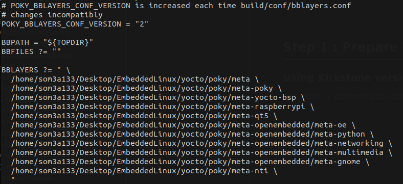

### Local.conf: 

```
MACHINE ??= "raspberrypi4-64"
IMAGE_ROOTFS_EXTRA_SPACE = "502880"
####Some packages of Qt to be installed
IMAGE_INSTALL += " qtbase-tools qtbase qtdeclarative qtimageformats qtmultimedia qtquickcontrols2 qtquickcontrols qtbase-plugins liberation-fonts"
PACKAGECONFIG_FONTS:append_pn-qtbase = " fontconfig"

```

# Step 3 : Bitbake Image & Toolchain

```
bitbake core-image-sato 
```

Normal command of populate_sdk will not generate files needed by Qt:

```
 bitbake <image> -c populate_sdk
```

`So i will use this as it do populate_sdk & populate_sdk_qt5  [check meta-toolchain-qt5.bb]`

```
bitbake meta-toolchain-qt5
```


# Step 4 : Output for toolchain

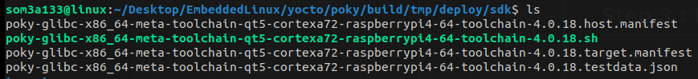

Now we run .sh script and choose directory to install it  :

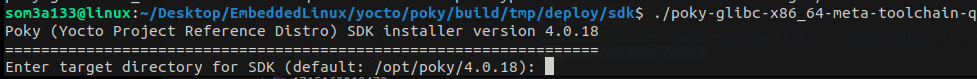

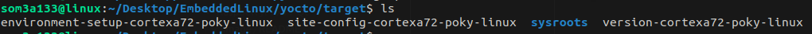

do: source env

```
source environment-setup-cortexa72-poky-linux
```

# Step 5 : Prepare Qt5 creator for Cross-compilation

**Used Version is : `5.15.2`**

### **First:** Add new device and configure it with ssh hostname / ip

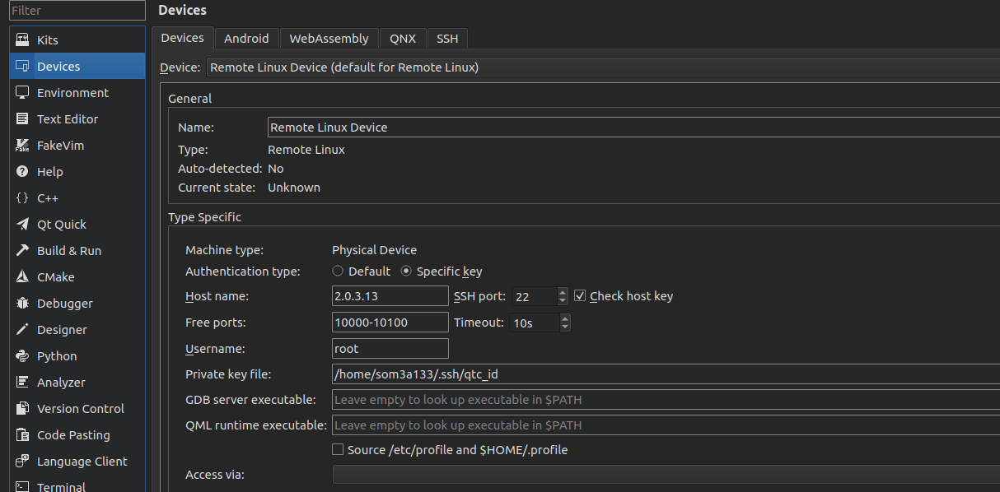

### **Second : Add new kit**

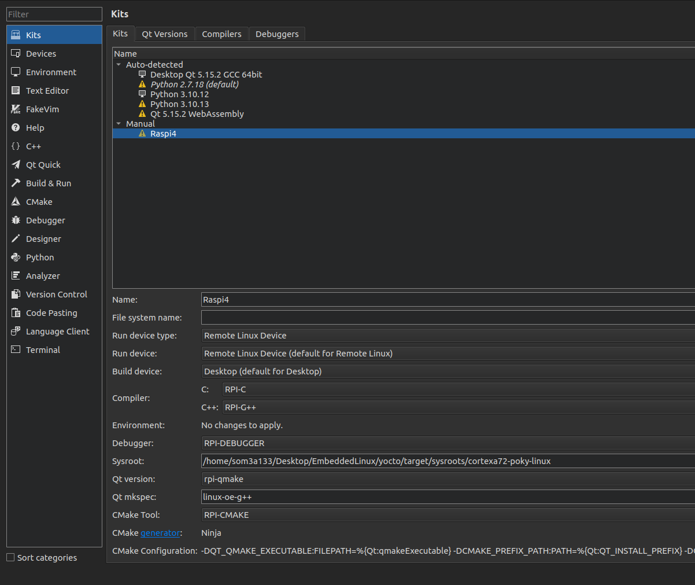

**Do Test Kit to check your ssh and check if any packges not found .**

### Third : Configure your C/C++/Qt Version/CMake

C/C++ Compilers will be found here

```
/<>/target/sysroots/x86_64-pokysdk-linux/usr/bin/aarch64-poky-linux/aarch64-poky-linux-g++
```

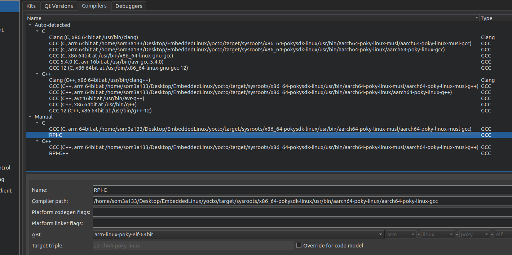

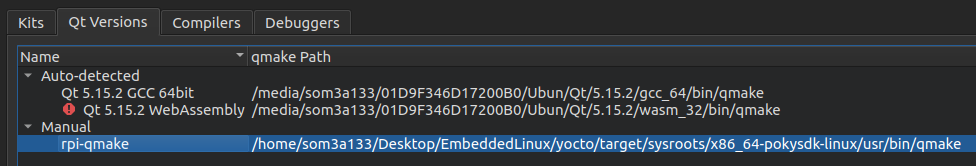

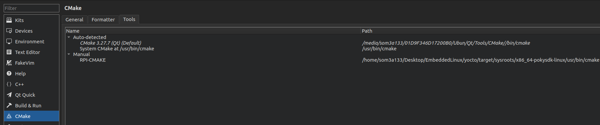

# Results : My First Qt app to test  Raspi4-x64


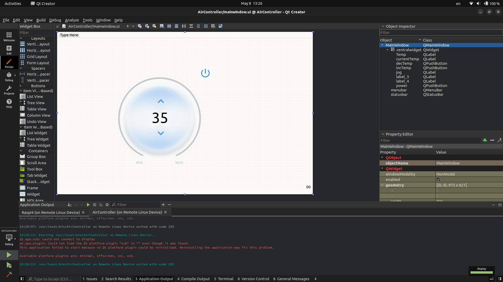

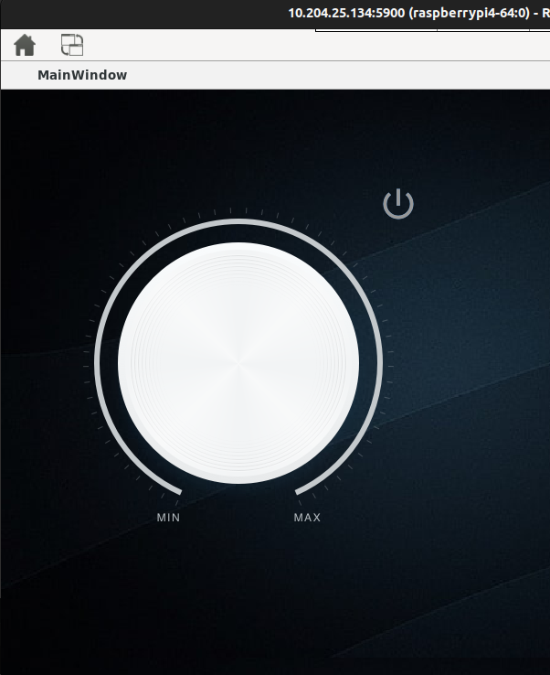


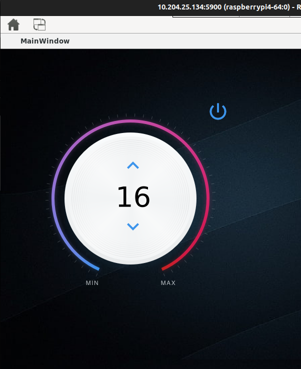
